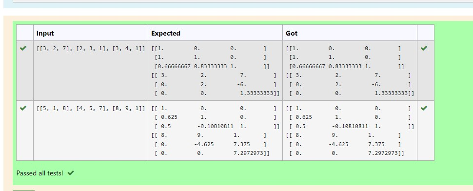
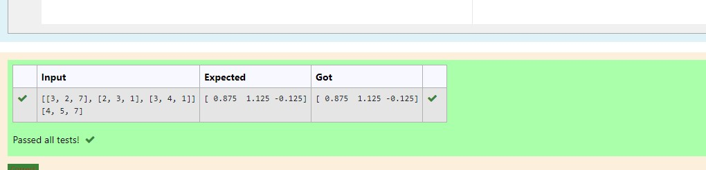

# LU Decomposition 

## AIM:
To write a program to find the LU Decomposition of a matrix.

## Equipments Required:
1. Hardware – PCs
2. Anaconda – Python 3.7 Installation / Moodle-Code Runner

## Algorithm
1.Import numpy library using import statement.
2.From scipy package import lu_factor() and lu_solve().
3.Get two inputs from user and pass it as matrix array.
4.Find lu and pivot value of first marix using lu_factor().
5.Find solution of the matrix by using lu_solve() by passing lu, pivot values as first argument and second matrix as second argument.
6.Print the solution.


## Program:
```
(i) To find the L and U matrix
Program to find L and U matrix using LU decomposition.
Developed by:MS.Jeeva
RegisterNumber:21500143


# To print L and U matrix
import numpy as np
from scipy.linalg import lu 
#import scipy
A =np.array(eval(input()))
P,L,U =lu(A)
print (L)
print (U)
```

## OUTPUT:

 

(ii) To find the LU Decomposition of a matrix
```
/*
Program to find the LU Decomposition of a matrix.
Developed by:MS.Jeeva
RegisterNumber: 21500143

# To print X matrix (solution to the equations)
import numpy as np
from scipy.linalg import lu_factor,lu_solve
A=np.array(eval(input()))
B=np.array(eval(input()))
lu, pivot= lu_factor(A)
x= lu_solve((lu,pivot),B)
print(x)

*/
```

## Output:



## Result:
Thus the program to find the LU Decomposition of a matrix is written and verified using python programming.

